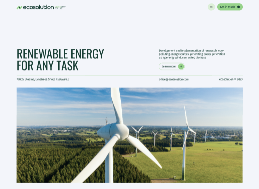
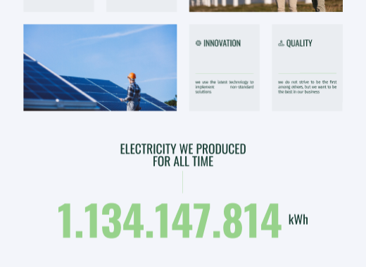
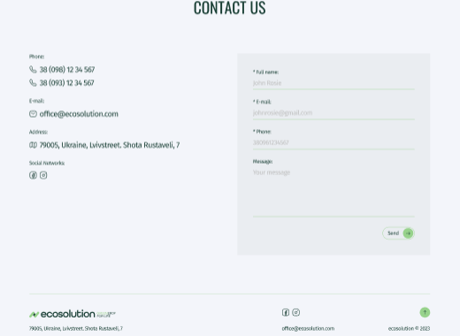
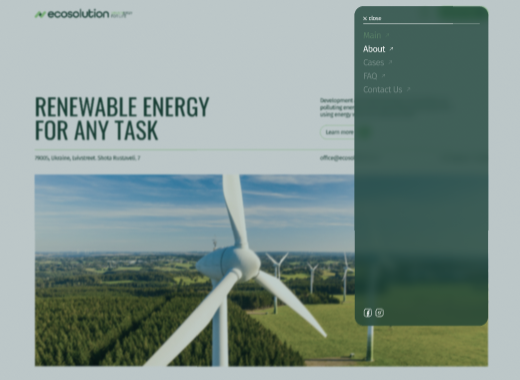

# Ecosolution SPA 📚 🖥️ 👨‍💻

### [GO TO LIVE DEMO PAGE HERE ](https://eco-solutions.onrender.com) 👀

Ecosolution is single page application.

Project structure:

- Header;
- Burger-menu;
- Main;
- About (Values);
- Electricity;
- Cases;
- FAQ;
- Contact Us;
- Footer;

##

 
 

##


## Installation and Usage ⚙️ 🚀 📅 💻

To get start application, follow these steps:

1.  Clone this repository to your local machine.
2.  Open the terminal and navigate to the project directory.
3.  Run the following commands:

```
# yarn package manager
yarn install
yarn start

# npm package manager
npm install
npm run start
```

Copy the repository to yourself

```shell
git clone https://github.com/BlackyHat/E-planner.git
```

## The web application using the following technologies and libraries: ⚙️ 🚧 🖥️

- JavaScript,
- TypeScript,
- React.js,
- React Hook Form,
- Zod,
- SASS

## Stay in touch 🤠 💼 🕔 🏁

- Author - [Oleksandr Podoliako](https://github.com/BlackyHat)
- Linkedin - [http://linkedin.com/in/oleksandr-vp](http://linkedin.com/in/oleksandr-vp)
- Telegram - [@blackhatty](https://t.me/blackhatty)
